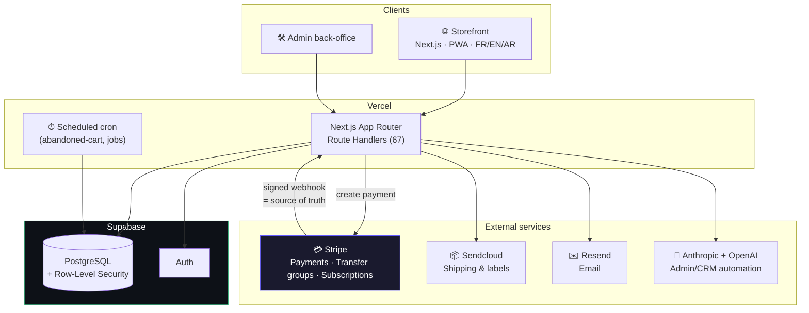
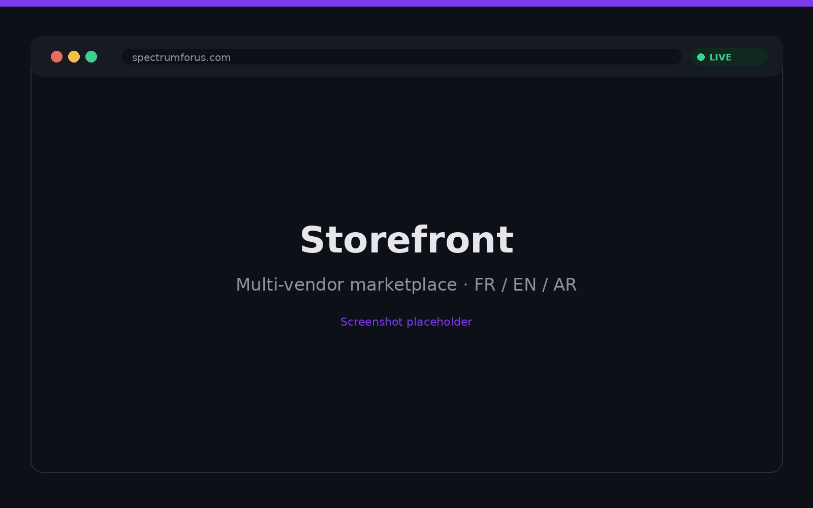
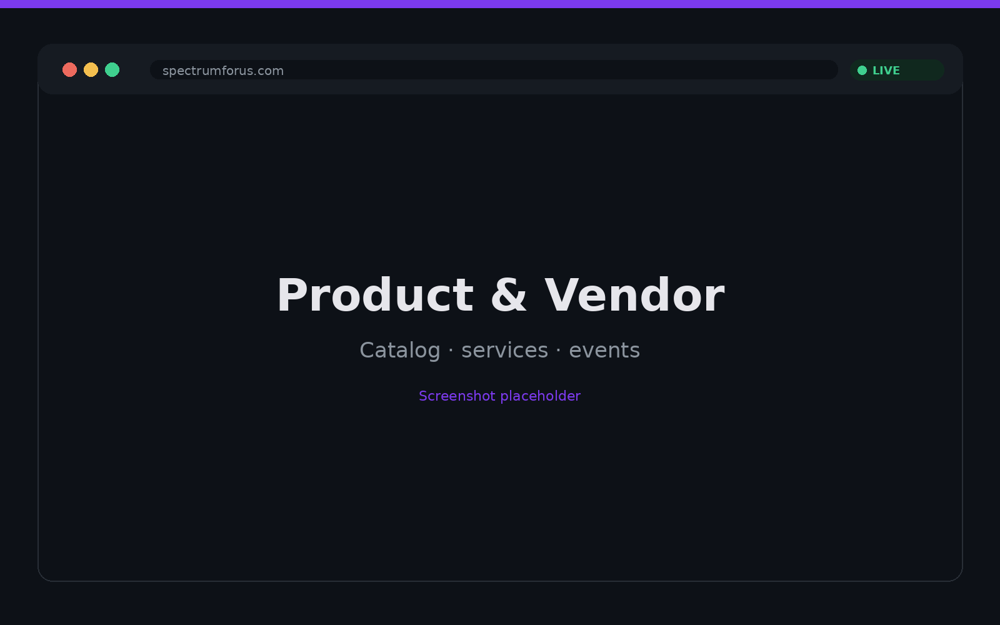
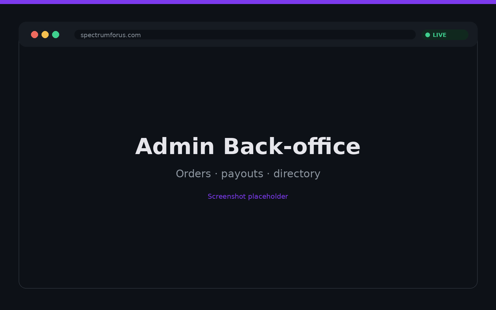

<div align="center">


# Spectrum for Us

**The e-commerce marketplace by and for the LGBTQIA+ community.**
Gender-free fashion, art, beauty, wellness, services & events — plus a directory of LGBTQIA+ associations.

[](https://spectrumforus.com)
[](https://spectrumforus.com)

[](https://nextjs.org)
[](https://react.dev)
[](https://www.typescriptlang.org)
[](https://supabase.com)
[](https://stripe.com)
[](https://vercel.com)

</div>

---

## What it is

Spectrum for Us is a real, revenue-generating multi-vendor marketplace built to give the LGBTQIA+ community a commercial home of its own. Buyers discover and purchase gender-free fashion, art, beauty and wellness creations, book services and events, and browse a curated directory of LGBTQIA+ associations. Creators sign up as vendors, list products and services, manage orders and shipping, and get paid — including in regions where automated payouts aren't available. The entire experience is multi-language (French, English, Arabic), installable as a PWA, and shipped to production by a single engineer.

## ✨ Key Features

**🛍 Marketplace**
- Multi-vendor catalog spanning physical products, digital creations, bookable services and events
- Product, vendor and category browsing with search, rich media and a directory of LGBTQIA+ associations
- Cart and checkout backed by Zustand state and a server-validated order pipeline

**💳 Payments & Payouts**
- Stripe Payment Intents with **transfer groups** to split funds across vendors per order
- Vendor **subscriptions** (recurring billing) and full **refund** support
- Signed Stripe **webhooks** as the source of truth for order creation
- **Manual payout fallback** for vendors in Tunisia, Morocco and Algeria where Stripe automated transfers aren't available — handled through a dedicated admin payouts workflow

**📦 Shipping**
- **Sendcloud** integration: dynamic pricing by parcel weight, **point-relais** (pickup-point) selection, and on-demand shipping-label generation for vendors

**🌈 Community**
- Directory of LGBTQIA+ associations with editorial overrides
- Events and service bookings with their own lifecycle and cancellation flows
- A founder program baked into the data model from day one

**🛠 Admin / Back-office**
- Full operational console: orders, vendors, payouts (versements), site content and directory management
- AI-assisted admin/CRM tooling powered by the Anthropic and OpenAI SDKs
- Automated lifecycle jobs (e.g. abandoned-cart recovery) on a scheduled cron

**🌍 i18n & PWA**
- `next-intl` localization across **French, English and Arabic** (including RTL)
- Installable Progressive Web App with a web manifest
- Transactional email via Resend; interactive maps via Mapbox GL

## 🏗 Architecture



**Design principles**

- **Single source of truth** — the public marketplace and the admin back-office run on the same Supabase schema and typed data layer, so there's no drift between what customers see and what operators manage.
- **Webhook-driven orders** — orders are never created optimistically on the client. The signed Stripe webhook is the authority: payment captured → order materialized server-side, which keeps state consistent even on dropped connections or retries.
- **Defense-in-depth with RLS** — Row-Level Security is the enforcement boundary. Privileged paths (webhook order creation, GDPR account deletion) run through the service-role key on the server only; the anon key never escapes the client.
- **Multi-path payouts** — the payout system abstracts over Stripe transfers *and* a manual settlement workflow, so vendors in countries without Stripe payout support are first-class rather than excluded.
- **Composable commerce primitives** — products, services, events and bookings share a coherent model with per-vendor fund splitting via Stripe transfer groups, making a true multi-vendor split-payment marketplace possible.
- **Hardened by default** — CSP/HSTS headers, webhook signature checks and HTML sanitization are wired in at the framework level, not bolted on.

## 📸 Screenshots

> Live at **[spectrumforus.com](https://spectrumforus.com)**. Add captures to `docs/screenshots/` and they'll render below.

| Storefront | Product / Vendor | Admin back-office |
|---|---|---|
|  |  |  |

## 🛠 Tech Stack

**Frontend** — Next.js 16 (App Router), React 19, TypeScript, Tailwind CSS 4, Framer Motion, Zustand, Recharts, Lucide

**Backend & Data** — Supabase (PostgreSQL, Auth, Row-Level Security), SQL migrations, Next.js Route Handlers

**Payments & Ops** — Stripe (Payment Intents, transfer groups, subscriptions, webhooks, refunds), Sendcloud (shipping), Resend (email), Mapbox GL, Vercel (hosting + cron)

**AI** — Anthropic SDK + OpenAI SDK for admin and CRM automation

**Security** — CSP & HSTS headers, Supabase RLS, Stripe webhook signature validation, DOMPurify sanitization

## 📊 By the numbers

- **~36,000** lines of TypeScript/TSX across **264** source files
- **78** React components and **67** API route handlers (**100+** endpoint methods)
- **245** commits — built and shipped solo
- **6** SQL migrations defining the Postgres schema
- **3** supported languages: French, English, Arabic
- **1** live production deployment serving real customers

## 🚀 Getting Started

**Prerequisites:** Node.js 20+, npm, and accounts/keys for Supabase, Stripe, Resend (Sendcloud, Mapbox and the AI providers are optional for local dev).

```bash
# 1. Clone
git clone <repo-url> spectrumforus
cd spectrumforus

# 2. Install dependencies
npm install

# 3. Configure environment
cp .env.example .env.local
```

Fill in `.env.local` with your keys:

| Variable | Purpose |
| --- | --- |
| `NEXT_PUBLIC_SUPABASE_URL` / `NEXT_PUBLIC_SUPABASE_ANON_KEY` | Supabase project + public client |
| `SUPABASE_SERVICE_ROLE_KEY` | Server-only; required for webhook order creation and GDPR deletion |
| `NEXT_PUBLIC_STRIPE_PUBLISHABLE_KEY` / `STRIPE_SECRET_KEY` | Stripe API keys |
| `STRIPE_WEBHOOK_SECRET` | Verifies incoming Stripe webhook signatures |
| `NEXT_PUBLIC_STRIPE_VENDOR_PRICE_ID` | Vendor subscription price |
| `NEXT_PUBLIC_SITE_URL` | App base URL |
| `RESEND_API_KEY` | Transactional email |
| `NEXT_PUBLIC_MAPBOX_TOKEN` | Maps (optional) |
| `ANTHROPIC_API_KEY` / `OPENAI_API_KEY` | AI admin/CRM features (optional) |

```bash
# 4. Run the dev server
npm run dev
```

Open [http://localhost:3000](http://localhost:3000).

> Apply the SQL files in `supabase/migrations/` to your Supabase project to provision the schema.

## 📄 License

**Proprietary** — all rights reserved. Source-available for portfolio and recruiting review only; not licensed for reuse, redistribution or deployment.

---

<div align="center">

Built by **Aïcha Chennaoui** · AI Product Builder

[](https://www.linkedin.com/in/aichachennaoui/)
[](mailto:chennaoui.aicha@gmail.com)
[](https://www.malt.fr/profile/aichachennaoui)

</div>
